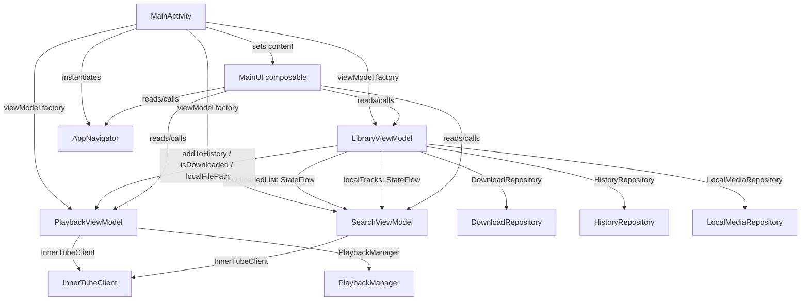

# Design Document: ViewModel Split and Navigation Refactor

## Overview

`MusicViewModel` currently spans 600+ lines and owns all search, playback, library, download, and navigation-adjacent logic in one class. `NavigationController` is a Kotlin `object` (global singleton) backed by a raw `mutableStateListOf` that can be mutated from any call site.

This refactor achieves two goals simultaneously:

1. **ViewModel decomposition** — extract three focused ViewModels (`SearchViewModel`, `PlaybackViewModel`, `LibraryViewModel`) each with a single clear responsibility.
2. **Navigation encapsulation** — replace the global `NavigationController` singleton with a scoped `AppNavigator` class that is instantiated once in `MainActivity` and passed down.

No DI framework is introduced. All ViewModels are constructed via `ViewModelProvider.Factory` where possible or via `remember {}` as a documented fallback. All existing UI behaviour (AnimatedVisibility overlays, PredictiveBackHandler, mini-player bar, SharedPreferences restore) is preserved without modification.

---

## Architecture

### High-Level Component Graph



### Key Design Decisions

**Why constructor-injected `StateFlow` instead of passing `LibraryViewModel` directly to `SearchViewModel`?**  
`SearchViewModel` only needs the _data_ (two reactive lists). Injecting the full `LibraryViewModel` reference would create a coupling that makes `SearchViewModel` impossible to test in isolation and violates single responsibility. The StateFlow approach matches Requirement 1.13 and 5.1 exactly.

**Why does `PlaybackViewModel` receive a `LibraryViewModel` reference (not just StateFlows)?**  
`PlaybackViewModel` needs to call `addToHistory(song)` imperatively every time a song starts, and `isDownloaded(songId)` / resolve local file paths during stream resolution. A callback/lambda approach would work but a direct reference is simpler given no DI framework, and it is explicitly permitted by Requirement 5.2 / 5.3. The dependency graph remains acyclic (LibraryViewModel does not reference PlaybackViewModel).

**Why `AppNavigator` as a plain class rather than a `ViewModel`?**  
Navigation state in this app is pure Compose `State` — no async work, no Android lifecycle dependencies beyond Activity scope. Making it a ViewModel is unnecessary complexity. It is instantiated in `MainActivity` and passed to `MainUI` either as a parameter or via `CompositionLocalProvider`.

**Construction order (no circular deps)**  
`LibraryViewModel` → `PlaybackViewModel` (receives LibraryViewModel) → `SearchViewModel` (receives LibraryViewModel.downloadedList and LibraryViewModel.localTracks). `AppNavigator` is independent.

---

## Components and Interfaces

### 1. `SearchViewModel`

**File:** `ui/SearchViewModel.kt`  
**Extends:** `AndroidViewModel(application)`

#### Constructor parameters

| Parameter | Type | Source |
|---|---|---|
| `application` | `Application` | Android framework |
| `downloadedSongs` | `StateFlow<List<Song>>` | `LibraryViewModel.downloadedList` |
| `localTracks` | `StateFlow<List<Song>>` | `LibraryViewModel.localTracks` |

#### Exposed state (all `StateFlow`, backing fields are `MutableStateFlow`)

| Property | Type | Initial value |
|---|---|---|
| `searchResults` | `StateFlow<List<Song>>` | `emptyList()` |
| `playlistResults` | `StateFlow<List<Playlist>>` | `emptyList()` |
| `playlistTracks` | `StateFlow<List<Song>>` | `emptyList()` |
| `artistTracks` | `StateFlow<List<Song>>` | `emptyList()` |
| `isArtistLoading` | `StateFlow<Boolean>` | `false` |
| `artistThumbnails` | `StateFlow<Map<String,String>>` | `emptyMap()` |
| `genreTracks` | `StateFlow<List<Song>>` | `emptyList()` |
| `isGenreLoading` | `StateFlow<Boolean>` | `false` |
| `isLoading` | `StateFlow<Boolean>` | `false` |
| `isPlaylistLoading` | `StateFlow<Boolean>` | `false` |
| `isLoadMoreLoading` | `StateFlow<Boolean>` | `false` |

#### Key private state

- `songContinuationToken: String?` — pagination cursor for song searches
- `playlistContinuationToken: String?` — pagination cursor for playlist searches
- `artistContinuationToken: String?`
- `genreContinuationToken: String?`
- `lastSearchQuery: String`
- `searchJob: Job?` — cancellable debounce job

#### Public methods (mirror current MusicViewModel)

`search(query)`, `loadMoreSongs()`, `loadArtistTracks(artistName)`, `loadMoreArtistTracks(artistName)`, `clearArtistTracks()`, `loadGenreTracks(genre)`, `loadMoreGenreTracks(genre)`, `clearGenreTracks()`, `searchPlaylists(query)`, `loadMorePlaylists()`, `loadPlaylistTracks(playlistId)`, `clearPlaylistTracks()`

#### Helper methods (moved from MusicViewModel unchanged)

`splitArtistNames(combinedName)`, `editDistance(s1, s2)`, `isArtistMatch(songArtist, targetArtist)`, `calculateMatchScore(song, query)`, `getSortedLocalMatches(query)` — these now read from the constructor-injected `downloadedSongs` and `localTracks` flows rather than `_downloadedList` / `_localTracks`.

#### Factory

```kotlin
class Factory(
    private val application: Application,
    private val downloadedSongs: StateFlow<List<Song>>,
    private val localTracks: StateFlow<List<Song>>
) : ViewModelProvider.Factory {
    @Suppress("UNCHECKED_CAST")
    override fun <T : ViewModel> create(modelClass: Class<T>): T =
        SearchViewModel(application, downloadedSongs, localTracks) as T
}
```

---

### 2. `PlaybackViewModel`

**File:** `ui/PlaybackViewModel.kt`  
**Extends:** `AndroidViewModel(application)`

#### Constructor parameters

| Parameter | Type | Source |
|---|---|---|
| `application` | `Application` | Android framework |
| `libraryViewModel` | `LibraryViewModel` | Constructed first in `MainUI` |

#### Exposed state

| Property | Type | Delegation |
|---|---|---|
| `currentSong` | `StateFlow<Song?>` | `playbackManager.currentSong` |
| `isPlaying` | `StateFlow<Boolean>` | `playbackManager.isPlaying` |
| `currentPosition` | `StateFlow<Long>` | `playbackManager.currentPosition` |
| `duration` | `StateFlow<Long>` | `playbackManager.duration` |
| `queue` | `StateFlow<List<Song>>` | `MutableStateFlow` |
| `currentQueueIndex` | `StateFlow<Int>` | `MutableStateFlow` |
| `isQueueEndless` | `StateFlow<Boolean>` | `MutableStateFlow(true)` |
| `isQueueLoadingMore` | `StateFlow<Boolean>` | `MutableStateFlow(false)` |
| `isStreamLoading` | `StateFlow<Boolean>` | `MutableStateFlow(false)` |

#### Key private state

- `playbackManager: PlaybackManager` — constructed internally with `application`
- `client: InnerTubeClient` — constructed internally
- `autoplayContinuationTokens: MutableMap<String, String>`
- `_originalPlaylistTracks: List<Song>`

#### Public methods

`playSong(song, initialQueue, isPremadePlaylist)`, `playSongInternal(song)` (internal), `playNextSong()`, `playPreviousSong()`, `playQueueSong(index)`, `generateAutoplaySongs()`, `togglePlayPause()`, `seekTo(positionMs)`, `playPlaylist(playlist)`, `isSongDownloaded(songId)`, `isSongDownloading(songId)`

Cross-ViewModel calls in `playSongInternal`:
- `libraryViewModel.addToHistory(song)`
- `libraryViewModel.isDownloaded(song.id)` / local path resolution

#### Factory

```kotlin
class Factory(
    private val application: Application,
    private val libraryViewModel: LibraryViewModel
) : ViewModelProvider.Factory {
    @Suppress("UNCHECKED_CAST")
    override fun <T : ViewModel> create(modelClass: Class<T>): T =
        PlaybackViewModel(application, libraryViewModel) as T
}
```

---

### 3. `LibraryViewModel`

**File:** `ui/LibraryViewModel.kt`  
**Extends:** `AndroidViewModel(application)`

#### Constructor parameters

Only `application: Application` — uses standard `AndroidViewModelFactory` or a simple custom factory.

#### Exposed state

| Property | Type | Initial value |
|---|---|---|
| `historyList` | `StateFlow<List<Song>>` | `emptyList()` |
| `downloadedList` | `StateFlow<List<Song>>` | `emptyList()` |
| `downloadingSongs` | `StateFlow<Set<String>>` | `emptySet()` |
| `downloadingQueue` | `StateFlow<List<Song>>` | `emptyList()` |
| `downloadProgress` | `StateFlow<Map<String,Int>>` | `emptyMap()` |
| `localTracks` | `StateFlow<List<Song>>` | `emptyList()` |
| `isScanning` | `StateFlow<Boolean>` | `false` |
| `localVideos` | `StateFlow<List<Movie>>` | `emptyList()` |
| `isVideoScanning` | `StateFlow<Boolean>` | `false` |

#### Internal repositories (constructed in init)

- `historyRepository: HistoryRepository = HistoryRepositoryImpl(application)`
- `downloadRepository: DownloadRepository = DownloadRepositoryImpl(application, InnerTubeClient())`
- `localMediaRepository: LocalMediaRepository = LocalMediaRepositoryImpl(application)`

#### Public methods

`addToHistory(song)`, `loadDownloads()`, `downloadSong(song)`, `isSongDownloaded(songId)`, `isSongDownloading(songId)`, `scanLocalFiles()`, `clearLocalTracks()`, `scanLocalVideos()`, `clearLocalVideos()`

#### Factory

```kotlin
class Factory(private val application: Application) : ViewModelProvider.Factory {
    @Suppress("UNCHECKED_CAST")
    override fun <T : ViewModel> create(modelClass: Class<T>): T =
        LibraryViewModel(application) as T
}
```

---

### 4. `AppNavigator`

**File:** `ui/Navigation.kt` (replaces `NavigationController` in the same file, `Destination` sealed class is unchanged)

#### State

```kotlin
class AppNavigator {
    val backStack: SnapshotStateList<Destination> = mutableStateListOf(Destination.Home)
    var currentTab: MusicTab by mutableStateOf(MusicTab.Home)
    var activePlaylist: Playlist? by mutableStateOf(null)
}
```

#### Computed properties

```kotlin
val currentDestination: Destination get() = backStack.lastOrNull() ?: Destination.Home
val isPlayerOpen: Boolean get() = backStack.lastOrNull() is Destination.Player
val isVideoPlayerOpen: Boolean get() = backStack.lastOrNull() is Destination.VideoPlayer
```

#### Methods (same logic as current NavigationController, encapsulated)

`navigateTo(dest: Destination)`, `goBack(): Boolean`, `syncTab(dest: Destination)` (private)

#### Instantiation and propagation

`AppNavigator` is instantiated in `MainActivity` as a field (not a ViewModel, not a singleton):

```kotlin
// MainActivity
private val appNavigator = AppNavigator()
```

It is passed to `MainUI` as a parameter:

```kotlin
MainUI(
    libraryViewModel = libraryViewModel,
    playbackViewModel = playbackViewModel,
    searchViewModel = searchViewModel,
    appNavigator = appNavigator
)
```

Alternatively, a `CompositionLocal` can be defined for ergonomics inside deeply nested composables:

```kotlin
val LocalAppNavigator = compositionLocalOf<AppNavigator> { error("No AppNavigator provided") }
```

The recommended approach is to pass it as a parameter to `MainUI` and pass it down only to composables that need it (bottom bar, back handler, overlay visibility checks). The `CompositionLocal` is an optional ergonomic layer for nested screens that the implementation may choose to use.

---

### 5. `MainUI` Composable — Updated Signature

```kotlin
@Composable
fun MainUI(
    libraryViewModel: LibraryViewModel,
    playbackViewModel: PlaybackViewModel,
    searchViewModel: SearchViewModel,
    appNavigator: AppNavigator
)
```

All `NavigationController.xxx` references inside `MainUI` are replaced by `appNavigator.xxx`. All `viewModel.xxx` calls are routed to the appropriate new ViewModel based on responsibility.

### 6. `MainActivity` — Updated ViewModel Construction

```kotlin
class MainActivity : ComponentActivity() {
    private val appNavigator = AppNavigator()

    // LibraryViewModel first — no dependencies on other ViewModels
    private val libraryViewModel: LibraryViewModel by viewModels {
        LibraryViewModel.Factory(application)
    }

    // PlaybackViewModel second — depends on LibraryViewModel
    // Note: viewModels {} is invoked lazily; LibraryViewModel is already constructed above.
    private val playbackViewModel: PlaybackViewModel by viewModels {
        PlaybackViewModel.Factory(application, libraryViewModel)
    }

    // SearchViewModel last — depends only on StateFlows from LibraryViewModel
    private val searchViewModel: SearchViewModel by viewModels {
        SearchViewModel.Factory(
            application,
            libraryViewModel.downloadedList,
            libraryViewModel.localTracks
        )
    }

    override fun onCreate(...) {
        ...
        setContent {
            ConveneMusicTheme {
                Surface(modifier = Modifier.fillMaxSize()) {
                    MainUI(
                        libraryViewModel = libraryViewModel,
                        playbackViewModel = playbackViewModel,
                        searchViewModel = searchViewModel,
                        appNavigator = appNavigator
                    )
                }
            }
        }
    }
}
```

> **Fallback note**: The `by viewModels { Factory(...) }` pattern requires that the Factory receives its arguments at delegate initialization time. Because `libraryViewModel` is a lazy delegate itself, care must be taken that it is accessed in the correct order. If this ordering causes issues at runtime, the fallback is to construct all three ViewModels inside `onCreate` using `ViewModelProvider(this, factory).get(Class)` calls in explicit order, documented with a code comment per Requirement 7.5.

---

## Data Models

No new data models are introduced. The existing types are preserved:

| Type | Location | Notes |
|---|---|---|
| `Song` | `network/InnerTubeClient.kt` | Unchanged |
| `Playlist` | `network/InnerTubeClient.kt` | Unchanged |
| `Movie` | `ui/Movie.kt` | Unchanged |
| `Destination` | `ui/Navigation.kt` | Unchanged sealed class |
| `MusicTab` | `ui/components/BottomBarTabs.kt` | Unchanged enum |

The `Song.viewCount` extension property (currently at the top of `MusicViewModel.kt`) is moved to a shared location — either a new `ui/Extensions.kt` file or co-located in `SearchViewModel.kt` since only `SearchViewModel` uses it for sorting.

---

## Correctness Properties

*A property is a characteristic or behavior that should hold true across all valid executions of a system — essentially, a formal statement about what the system should do. Properties serve as the bridge between human-readable specifications and machine-verifiable correctness guarantees.*

### Property 1: Search results contain no duplicate song IDs

*For any* non-blank search query and any combination of local songs and remote songs returned by `InnerTubeClient`, the `searchResults` list produced by `SearchViewModel.search()` shall contain no two entries with the same song ID.

**Validates: Requirements 1.2, 1.4**

---

### Property 2: Blank queries clear search state

*For any* string composed entirely of whitespace characters (including the empty string), calling `SearchViewModel.search()` with that string shall result in `searchResults` being empty and `isLoading` being `false`.

**Validates: Requirements 1.3**

---

### Property 3: Exception resilience in search

*For any* exception thrown by `InnerTubeClient` during a search or load operation, the `searchResults` StateFlow shall remain at its last valid value and the ViewModel shall not propagate the exception to the caller.

**Validates: Requirements 1.12**

---

### Property 4: `playSong` queue index invariant

*For any* song that appears in a non-empty initial queue, after calling `PlaybackViewModel.playSong(song, initialQueue)`, the value of `currentQueueIndex` shall be the index of the first occurrence of that song's ID in the queue.

**Validates: Requirements 2.2**

---

### Property 5: `playNextSong` advances index by exactly one

*For any* queue of size >= 2 and any current index in `[0, size-2]`, calling `PlaybackViewModel.playNextSong()` shall increment `currentQueueIndex` by exactly 1.

**Validates: Requirements 2.5**

---

### Property 6: `playPreviousSong` seek-to-zero when position >= 5000ms

*For any* playback position value >= 5000 ms, calling `PlaybackViewModel.playPreviousSong()` shall result in a seek-to-zero operation and `currentQueueIndex` shall remain unchanged.

**Validates: Requirements 2.7**

---

### Property 7: `playPreviousSong` decrements index when position < 5000ms

*For any* playback position value < 5000 ms and any current index >= 1, calling `PlaybackViewModel.playPreviousSong()` shall decrement `currentQueueIndex` by exactly 1.

**Validates: Requirements 2.8**

---

### Property 8: `addToHistory` deduplication and truncation invariant

*For any* existing history list (of any length, including length > 50) and any song (whether or not it already appears in the list), after `LibraryViewModel.addToHistory(song)`:
- The first element of `historyList` is the added song.
- No song ID appears more than once.
- The length of `historyList` is at most 50.

**Validates: Requirements 3.3**

---

### Property 9: `downloadSong` idempotency

*For any* song that is already downloaded or already in `downloadingSongs`, calling `LibraryViewModel.downloadSong(song)` again shall leave `downloadingQueue`, `downloadingSongs`, and `downloadProgress` unchanged.

**Validates: Requirements 3.6**

---

### Property 10: `AppNavigator.navigateTo` pop-to behaviour for tab destinations

*For any* back-stack containing a `Home`, `SearchList`, or `Library` destination at any position, calling `AppNavigator.navigateTo()` with that same destination type shall result in the back-stack having that destination as its last entry with no entries above it.

**Validates: Requirements 4.3**

---

### Property 11: `AppNavigator.navigateTo` append-once for overlay destinations

*For any* back-stack, calling `AppNavigator.navigateTo()` with the same `Player`, `PlaylistDetail`, or `VideoPlayer` destination twice in a row shall result in that destination appearing exactly once at the top of the back-stack.

**Validates: Requirements 4.4**

---

### Property 12: `AppNavigator.goBack` reduces back-stack size by one

*For any* back-stack of size >= 2, calling `AppNavigator.goBack()` shall reduce the back-stack size by exactly 1 and return `true`. For a back-stack of size 1, it shall return `false` and not modify the back-stack.

**Validates: Requirements 4.5, 4.6**

---

### Property 13: `AppNavigator` tab-sync invariant

*For any* sequence of `AppNavigator.navigateTo()` calls, after each call `currentTab` shall equal the tab corresponding to the most recent non-overlay (non-`Player`, non-`VideoPlayer`) destination in the back-stack, matching the `syncTab` mapping: `Home → MusicTab.Home`, `SearchList/PlaylistDetail → MusicTab.Search`, `Library → MusicTab.Library`.

**Validates: Requirements 4.7**

---

### Property 14: Mini-player visibility formula

*For any* combination of `currentSong` (nullable), `isPlayerOpen`, `isVideoPlayerOpen`, and `nonPlayerDest`, the mini-player bar shall be visible if and only if:
`currentSong != null && !isPlayerOpen && !isVideoPlayerOpen && nonPlayerDest != Destination.Home`.

**Validates: Requirements 6.4**

---

## Error Handling

### Network errors in SearchViewModel

- `InnerTubeClient` exceptions are caught in every `viewModelScope.launch` block via `try/catch(Exception)`.
- `CancellationException` is re-thrown (standard coroutine practice) or ignored only within the debounce `searchJob`.
- On error: log with `Log.e`, leave `_searchResults` / `_playlistResults` at their current value, set `_isLoading` to `false`.

### Stream URL resolution failure in PlaybackViewModel

- If `InnerTubeClient.getStreamUrl()` returns `null`, log the failure and leave `PlaybackManager` in its current state. `_isStreamLoading` is set to `false`. No toast/notification is shown to the user (matches existing behaviour).

### Download failure in LibraryViewModel

- `DownloadRepository.download()` returning `false` triggers a failure notification via `NotificationManager` and removes the song from `downloadingSongs`, `downloadingQueue`, `downloadProgress`.

### Local scan exceptions in LibraryViewModel

- `LocalMediaRepository.scanAudio()` / `scanVideo()` exceptions are caught, logged, and `isScanning` / `isVideoScanning` reset to `false`. Lists remain empty.

### AppNavigator defensive checks

- `navigateTo` and `goBack` never throw; they silently guard against empty stacks (`lastOrNull()` pattern).

---

## Testing Strategy

### Unit Tests

Focus on pure business logic that can be tested without Android instrumentation:

- `AppNavigator` — all navigation methods are pure state operations on a `SnapshotStateList`. Use `robolectric` or pure JVM tests with Compose `State` APIs.
- `SearchViewModel.getSortedLocalMatches()`, `isArtistMatch()`, `editDistance()` — pure functions, no Android context needed.
- `LibraryViewModel.addToHistory()` deduplication/truncation logic — testable with in-memory `HistoryRepository` stub.
- `PlaybackViewModel` queue index arithmetic — `playNextSong`, `playPreviousSong` index logic is testable with a mock `PlaybackManager`.

### Property-Based Tests

Use **[Kotest Property Testing](https://kotest.io/docs/proptest/property-based-testing.html)** (Kotlin-native, JVM, no additional setup beyond a Gradle dependency) with **minimum 100 iterations per property**.

Tag format for each property test: `// Feature: viewmodel-navigation-refactor, Property {N}: {property_text}`

**Property 1** — `SearchViewModel` deduplication: generate arbitrary lists of `Song` objects with randomized IDs (including duplicates), pass to the merge logic, assert `distinctBy { it.id }.size == result.size`.

**Property 2** — Blank query clearing: generate arbitrary whitespace strings (`"", " ", "\t\n"`), call `search()`, assert `searchResults.value.isEmpty()`.

**Property 3** — Exception resilience: for each search operation, inject a mock `InnerTubeClient` that throws a random exception; assert the StateFlow value before and after the call is the same non-null list.

**Property 4** — `playSong` queue index: generate random `Song` lists and a random element from the list as the target song; assert `currentQueueIndex == list.indexOfFirst { it.id == song.id }`.

**Property 5** — `playNextSong` index advance: generate a queue of size >= 2 and a random start index in `[0, size-2]`; assert index increments by 1.

**Properties 6 & 7** — Previous song position boundary: generate random `Long` values; split on `>= 5000` vs `< 5000`; assert seek-to-zero or index decrement accordingly.

**Property 8** — `addToHistory` invariants: generate arbitrary lists of `Song` (any size) and a random target song (possibly already in list); assert all three invariants after the call.

**Property 9** — Download idempotency: pre-populate `downloadingSongs` or `isDownloaded` with the song; call `downloadSong(song)` again; snapshot and compare queue/progress before and after.

**Properties 10–13** — `AppNavigator` navigation: use `Arb.list(Arb.element(allPossibleDestinations))` to generate random navigation sequences; execute each and assert back-stack shape and `currentTab` sync invariant.

**Property 14** — Mini-player visibility: generate all 8 boolean combinations of `(currentSong != null, isPlayerOpen, isVideoPlayerOpen)` plus `nonPlayerDest` variants; assert visibility formula matches spec.

### Integration Tests (examples)

- End-to-end playback: `LibraryViewModel` → `PlaybackViewModel` history write-through (after a song plays, `historyList` contains it).
- Factory construction: all three factories produce non-null ViewModel instances with correct initial state.
- `AppNavigator` is not a singleton: two independently constructed instances have independent back-stacks.

### Smoke Tests

- `SearchViewModel` constructor accepts two `StateFlow` parameters.
- `AppNavigator` is a `class`, not an `object`.
- `LibraryViewModel` creates a notification channel on init (API 26+).
- `PlaybackServiceConnector` callbacks are registered non-null after `PlaybackViewModel.init`.
